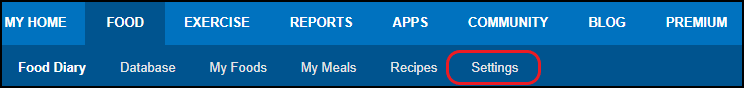
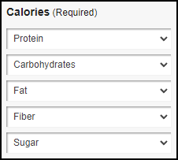
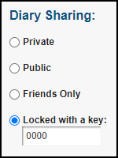

# MyFitnessPal_to_MyTransPhormation
Python script that will scrape nutrition data from MyFitnessPal and upload it to MyTransPhormation

# Installation Instructions

## Dependencies
1. [Python 3.9](https://www.python.org/downloads/release/python-390/)
2. [Selenium](https://www.selenium.dev/)
3. [Chromedriver](https://chromedriver.chromium.org/downloads)

## Configure MyFitnessPal
1. Visit [MyFitnessPal](https://www.myfitnesspal.com/)
2. Select settings

3. Configure the "Nutrients Tracked:" sections as follows:

4. Set your "Diary Sharing:" to "Locked with a key:" and set your key to your choice. 

5. Make note of your diary link (including the text behind the black box)

## Setup Your Configuration File
1. Inside of /script open **configuration.py**

| NAME | Description |
| ---------------- | ------------- |
| CHROMEDRIVER_PATH | This is the path (in your filesystem) to the chromedriver.exe that wasinstalled during the **Dependencies** section.|
| MFP_URL | The URL that was copied in the last step of **Configure MyFitnessPal**|
| MFP_PIN | The pincode that was chosen in step 4 of **Configure MyFitnessPal**|
| FP_EMAIL | Your email you use to login to [MyTransformation](https://app.mytransphormation.com/dashboard)|
| FP_PASSWORD | The password used to login to [MyTransformation](https://app.mytransphormation.com/dashboard) (I recommend using a randomly generated one since it will be stored in plain text on your PC)|

## Running For the First Time
Whenever you run this script, it will collect information for the previous day on [MyFitnessPal](https://www.myfitnesspal.com/) and upload it to that same date on [MyTransformation](https://app.mytransphormation.com/dashboard).

1. Create a **.bat** file and name it whatever you want, I have named mine **schedule.bat**
2. Open the **schedule.bat** file and add the following two lines of information
   - cd "C:\PATH\TO\YOUR\SCRIPT\FOLDER\"
   - "C:\Python39\python.exe" "C:\PATH\TO\YOUR\SCRIPT\FOLDER\script.py"
3. Save and close the file
4. Double-Click on **schedule.bat** to run the batch file
5. Watch the program work and ensure that it captures the correct data.
   - A log file will be generated that contains the information collected from [MyFitnessPal](https://www.myfitnesspal.com/)

## Schedule to Run Daily
I'm lazy so follow this link to create a task in Windows Task Scheduler